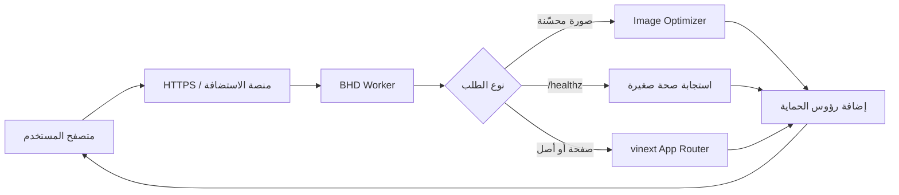
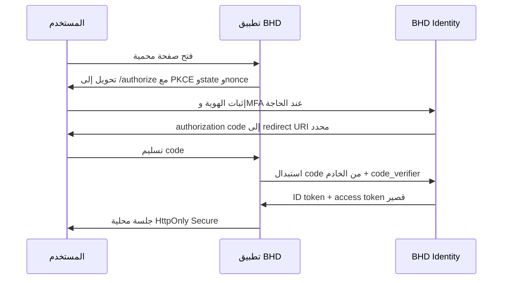
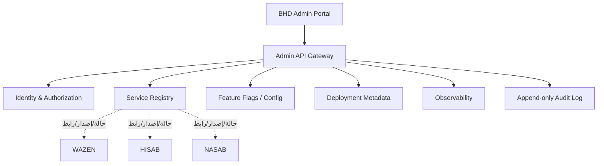

# وثيقة بوابة BHD التقنية والهندسية الشاملة

> **المشروع:** BHD Portal — Bin Hamood Development  
> **وعد العلامة:** Build Higher Dreams — ابنِ أحلامًا أكبر  
> **الإصدار الموثق:** 1.0.0  
> **تاريخ الوثيقة:** 16 أغسطس 2026  
> **المالك:** شركة بن حمود للتطوير — مسقط، سلطنة عُمان  
> **حالة الوثيقة:** مرجع البناء والتشغيل والتكامل والتوسع

---

## 1. الغرض من الوثيقة

هذه الوثيقة هي المرجع الهندسي للبوابة الرئيسية لشركة بن حمود للتطوير. وهي تشرح ما يلي:

- لماذا بنيت البوابة وما الدور الذي تؤديه داخل منظومة BHD.
- ما الذي يعمل حاليًا فعلًا، وما الذي ما زال تصميمًا مستقبليًا.
- بنية المشروع، الصفحات، المكونات، الأصول، والتقنيات المستخدمة.
- قرارات الأداء، الأمان، الخصوصية، الأرشفة، وإتاحة الاستخدام.
- طريقة التشغيل والاختبار والنشر والاسترجاع.
- آلية ربط منتجات BHD الحالية والمستقبلية.
- التصميم المقترح للدخول الموحد BHD Identity.
- التصميم المقترح للتحكم المركزي دون خلط قواعد بيانات المنتجات.
- طريقة ضم أي منتج جديد إلى المنظومة.

يجب تحديث هذه الوثيقة مع كل تغيير معماري أو أمني أو تشغيلي مهم.

---

## 2. الملخص التنفيذي

بوابة BHD هي واجهة العلامة الأم ودليل منتجاتها. هي ليست نسخة من التطبيقات التابعة، ولا قاعدة بيانات مركزية لكل أعمالها. دورها الحالي هو:

1. تقديم شركة Bin Hamood Development ووعدها **Build Higher Dreams**.
2. عرض منتجات BHD وإرسال المستخدم إلى الموقع الصحيح لكل منتج.
3. شرح فلسفة المنظومة وبنيتها التقنية.
4. توفير صفحات الثقة: الأمان، الخصوصية، الشروط، والتواصل.
5. توفير مشغّل تطبيقات سريع ودليل ذكي يعمل محليًا داخل المتصفح.
6. تجهيز أساس قابل للتوسع نحو هوية موحدة ولوحة تحكم مركزية.

الحساب الموحد والتحكم التشغيلي بكل المنتجات **ليسا مطبقين بعد**. الصفحة الحالية تشرح الرؤية المستقبلية فقط. عند التنفيذ يجب بناء خدمة هوية مستقلة وتكامل كل تطبيق معها وفق OpenID Connect، لا إضافة نموذج دخول شكلي داخل البوابة.

---

## 3. فلسفة العلامة

### 3.1 المعنى المزدوج

- **BHD = Bin Hamood Development**: الاسم القانوني والمؤسسي.
- **BHD = Build Higher Dreams**: الوعد الإنساني والتسويقي.

### 3.2 معنى الحروف

| الحرف | الكلمة | المعنى العملي |
|---|---|---|
| B | BUILD | نبني أفكارًا ومنتجات وأعمالًا قابلة للحياة. |
| H | HIGHER | نرفع مستوى الجودة والطموح والتقنية والخدمة. |
| D | DREAMS | نحول طموحات الأفراد والعائلات والشركات إلى واقع. |

### 3.3 الصيغ المعتمدة

- الاسم: **Bin Hamood Development**
- العلامة: **BHD**
- الوعد: **Build Higher Dreams**
- العربية المختصرة: **ابنِ أحلامًا أكبر.**
- العربية المرتبطة بالشركة: **ابنِ أحلامًا أكبر مع بن حمود للتطوير.**

---

## 4. نظام الشعار والأصول

### 4.1 سبب إعادة البناء

الملفات المصدرية التي كانت متاحة للبوابة صور نقطية صغيرة: نسخة كاملة تقريبًا `274×88` بكسل ونسخة للرمز تقريبًا `275×185` بكسل. تكبيرها على شاشات عالية الكثافة كان يسبب التعرج والتشوه.

أعيد رسم الشعار هندسيًا مع المحافظة على فكرته: حرف B باللون الفيروزي، حرف H باللون البحري، وحرف D المفتوح باللون الفيروزي. النتيجة ليست تكبيرًا للصورة القديمة؛ إنها مسارات متجهية تعاد رسمها بأي حجم دون فقد الدقة.

### 4.2 الملفات المعتمدة

| الملف | الاستخدام |
|---|---|
| `public/brand/bhd-logo.svg` | الشعار الكامل داخل الموقع، متجهي وغير محدود الدقة. |
| `public/brand/bhd-mark.svg` | رمز BHD داخل الأيقونات والأختام. |
| `public/brand/bhd-logo-4096.png` | نسخة شفافة كبيرة بعرض 4096 بكسل للتسليم والاستخدامات النقطية. |
| `public/brand/bhd-mark-2048.png` | رمز مربع شفاف 2048×2048 للأيقونات. |
| `scripts/render_brand_assets.py` | إعادة إنتاج نسخ PNG من هندسة الشعار. |

### 4.3 ألوان الشعار

| اللون | القيمة |
|---|---|
| BHD Teal | `#08A39F` |
| BHD Navy | `#174B70` |

طبقة العرض في الموقع تستخدم الشعار كقناع CSS، ولذلك يمكن إنتاج نسخ حبرية أو بيضاء أو متدرجة دون نسخ ملفات إضافية أو تقليل الدقة.

### 4.4 قواعد الاستخدام

- استخدم SVG على الويب وفي الطباعة المتجهية.
- استخدم PNG الكبير فقط عندما لا يقبل النظام ملفات SVG.
- لا تمدد الشعار بشكل يغير نسبة أبعاده.
- لا تستخدم الصورة القديمة منخفضة الدقة.
- اترك مساحة آمنة حول الشعار لا تقل بصريًا عن ارتفاع حرف H.
- احتفظ بالألوان الأصلية في المواد الرسمية؛ النسخة أحادية اللون مسموحة فوق الخلفيات الخاصة.

---

## 5. نطاق النسخة الحالية

### 5.1 ما يعمل الآن

- واجهة عربية وإنجليزية في الصفحة الرئيسية.
- صفحات مستقلة للشركة والمنتجات والتقنية والأمان والخصوصية والشروط والتواصل.
- صفحات تفصيلية ديناميكية لكل منتج.
- روابط مباشرة إلى مواقع المنتجات ومستودعاتها.
- مشغّل تطبيقات من الرأس وصفحة `/apps`.
- انتقالات داخلية سريعة مع prefetch للمسارات المهمة.
- دليل منتجات ذكي محلي قائم على مطابقة الاحتياج بالكلمات المفتاحية.
- بيانات وصفية لمحركات البحث وOpen Graph وTwitter Cards.
- `robots.txt` و`sitemap.xml` وWeb App Manifest.
- بيانات منظمة Schema.org من نوع Organization وWebSite.
- رؤوس حماية مركزية في طبقة Worker.
- مسار صحة بسيط `/healthz` لا يكشف أسرارًا.
- حالات خطأ 404 وخطأ تشغيل قابلة للاسترجاع.
- تصميم متجاوب وتقليل الحركة عند طلب المستخدم ذلك.
- نشر خاص حاليًا على Sites؛ الوصول خاضع لسياسة منصة الاستضافة.

### 5.2 ما لا يعمل بعد

- لا توجد حسابات BHD عامة بعد.
- لا توجد خدمة BHD Identity أو مزود OpenID Connect بعد.
- لا يوجد دخول موحد بين المنتجات بعد.
- لا توجد لوحة إدارة مركزية للإصدارات والحالة والصلاحيات بعد.
- لا يوجد ذكاء اصطناعي خارجي أو إرسال لنص المستخدم إلى نموذج.
- لا توجد قاعدة بيانات تشغيلية للبوابة.
- لا تجمع البوابة الحالية بيانات المستخدم أو بيانات المنتجات.

هذه الحدود مقصودة وتمنع تقديم واجهة وهمية أو جمع بيانات قبل اكتمال الأساس الأمني والقانوني.

---

## 6. المنتجات المرتبطة

| المنتج | المجال | المستودع | وجهة الإطلاق الحالية |
|---|---|---|---|
| WAZEN / وازن | إدارة الأموال | `github.com/ainoamn/WAZEN` | `wazen-roan.vercel.app` |
| HISAB / حسابي | المحاسبة والأعمال | `github.com/ainoamn/BHD-Pro` | `bhd-pro.vercel.app` |
| AIN OMAN / عين عُمان | العقار والاستثمار | `github.com/ainoamn/ainoamn-ain-oman-web` | المستودع مؤقتًا |
| NASAB / نَسَب | شجرة العائلة | `github.com/ainoamn/Nasab` | `nasab-mu.vercel.app` |
| BHD STORE | التجارة الإلكترونية | `github.com/ainoamn/BHD-STOR` | المستودع مؤقتًا |
| BHD OFFICE | تشغيل الأعمال | `github.com/ainoamn/bhd-om` | نظام داخلي/المستودع |

المرجع البرمجي لهذه البيانات هو `app/lib/products.ts`. يجب تعديل البيانات هناك بدل تكرارها داخل المكونات.

المستودع `ainoamn/nextjs-boilerplate` قالب تطوير وليس منتجًا موجهًا للمستخدم؛ لذلك لا يظهر كبطاقة منتج في النسخة الحالية.

---

## 7. خريطة المسارات

| المسار | الوظيفة | الفهرسة |
|---|---|---|
| `/` | الصفحة الرئيسية وفلسفة العلامة | مسموحة عند النشر العام |
| `/products` | دليل المنتجات | مسموحة |
| `/products/[slug]` | تفاصيل المنتج | مسموحة |
| `/about` | الشركة والرؤية | مسموحة |
| `/technology` | التقنية والبنية | مسموحة |
| `/security` | الحماية والثقة | مسموحة |
| `/privacy` | سياسة الخصوصية | مسموحة |
| `/terms` | شروط الاستخدام | مسموحة |
| `/contact` | قنوات التواصل | مسموحة |
| `/apps` | مشغّل التطبيقات | مسموحة |
| `/login` | شرح الحساب الموحد المستقبلي | ممنوعة من الأرشفة والتخزين |
| `/healthz` | فحص حياة الخدمة | JSON، غير مخزن |
| `/.well-known/security.txt` | قناة الإفصاح الأمني | ملف معياري |

---

## 8. التقنيات والإصدارات

### 8.1 طبقة الواجهة والخادم

| التقنية | الإصدار المثبت | الدور |
|---|---:|---|
| React | 19.2.6 | بناء المكونات التفاعلية. |
| React DOM | 19.2.6 | عرض الواجهة في المتصفح والخادم. |
| TypeScript | 5.9.3 | أنواع ثابتة وتقليل أخطاء التكامل. |
| vinext | 1.0.0-beta.2 | تشغيل نموذج Next App Router فوق Vite/Cloudflare. |
| Vite | 8.0.13 | البناء والتطوير السريع. |
| Tailwind CSS | 4.2.1 | متاح في سلسلة CSS؛ معظم الهوية مكتوبة CSS مخصصًا. |
| Cloudflare Vite Plugin | 1.37.1 | محاكاة وبناء بيئة Worker. |
| Wrangler | 4.92.0 | أدوات بيئة Cloudflare. |
| Drizzle ORM | 0.45.2 | جاهز اختياريًا؛ لا جداول مستخدمة حاليًا. |

يتطلب المشروع Node.js `>=22.13.0`.

### 8.2 لماذا هذه البنية؟

- Server Components تقلل JavaScript المرسل للصفحات الثابتة.
- Client Components تستخدم فقط في الأجزاء التي تحتاج حالة أو تفاعلًا.
- Vite يعطي دورة تطوير وبناء سريعة.
- Worker يطبق الحماية على كل الاستجابات من مكان واحد.
- عدم إضافة مكتبات واجهة ثقيلة يحافظ على الحجم والمرونة.
- تعريف المنتجات في ملف واحد يمنع اختلاف البيانات بين الصفحات.

---

## 9. بنية المستودع

```text
.
├── .openai/hosting.json          # معرف مشروع الاستضافة والموارد
├── app/
│   ├── components/              # مكونات الهوية والتنقل والدليل الذكي
│   ├── lib/products.ts           # سجل المنتجات الحالي
│   ├── products/[slug]/          # صفحات المنتجات الديناميكية
│   ├── layout.tsx                # البيانات الوصفية والهيكل العام
│   ├── page.tsx                  # الصفحة الرئيسية
│   ├── manifest.ts               # تعريف تطبيق الويب
│   ├── robots.ts                 # قواعد محركات البحث
│   ├── sitemap.ts                # خريطة الموقع
│   ├── error.tsx                 # استرجاع أخطاء الواجهة
│   ├── not-found.tsx             # 404
│   └── globals.css               # نظام التصميم والاستجابة
├── public/
│   ├── brand/                    # أصول الشعار عالية الدقة
│   ├── images/                   # صور العرض المحسنة
│   └── .well-known/security.txt  # الإفصاح الأمني
├── scripts/                      # إعادة إنتاج أصول العلامة وتحسين الصور
├── tests/rendered-html.test.mjs  # اختبارات الإنتاج والرؤوس والمسارات
├── worker/index.ts               # نقطة الدخول وسياسات الحماية والتخزين المؤقت
├── vite.config.ts                # vinext وSites وCloudflare
└── package.json                  # الإصدارات والأوامر
```

لا ترفع `node_modules` أو `.env*` أو `.wrangler` أو `dist` أو `outputs` إلى Git.

---

## 10. تدفق الطلب الحالي



كل استجابة تمر على `withSecurityHeaders`. هذا يمنع وجود صفحة محمية وسياسة أضعف بسبب نسيان إعداد محلي.

---

## 11. المكونات الرئيسية

### 11.1 `BrandLogo`

يعرض الشعار الكامل أو الرمز، وبنغمة حبرية أو بيضاء أو متدرجة. المصدر SVG ويظهر حادًا على كل كثافات البكسل.

### 11.2 `InstantLink`

رابط داخلي يستخدم آلية التنقل في App Router مع prefetch. الروابط الخارجية تبقى روابط عادية وتفتح مع `noopener noreferrer` عند الحاجة.

### 11.3 `NavigationWarmup`

بعد 300 ملي ثانية من الاستقرار يطلب تجهيز أهم المسارات في الخلفية. النتيجة أن الانتقال إليها يشعر بأنه فوري بعد فتح الصفحة الأولى.

### 11.4 `BhdAdvisor`

دليل محلي يطابق عبارة المستخدم بكلمات مفتاحية ويقترح منتجًا. لا يستدعي API ولا يرسل النص خارج الجهاز. الحوار:

- يدعم زر Escape.
- يحبس التركيز داخله عند الفتح.
- يعيد التركيز إلى زر التشغيل بعد الإغلاق.
- يعلن النتيجة عبر `aria-live`.

هذا **ليس نموذج ذكاء اصطناعي خارجيًا** في الإصدار الحالي.

### 11.5 `InnerPageShell`

هيكل موحد للصفحات الداخلية: رأس، عنوان، محتوى، وتذييل. يقلل التكرار ويجعل تغيير الهوية مركزيًا.

---

## 12. نظام التصميم والاستجابة

### 12.1 المبادئ

- اتجاه عربي RTL افتراضي مع دعم LTR للإنجليزية.
- ألوان هادئة مستلهمة من الهوية العُمانية: الأخضر الداكن، الرمل، الأبيض الدافئ، والذهبي.
- مساحات واسعة وتباين هرمي واضح بدل الزخرفة الكثيفة.
- وحدات `clamp()` للعناوين كي تتدرج بسلاسة.
- شبكات تتحول من عمودين أو ثلاثة إلى عمود واحد.
- صور مرنة مع `sizes` وتحسين على الحافة.
- حدود لمس مناسبة للأزرار المهمة.

### 12.2 نقاط التحول

| العرض | السلوك الرئيسي |
|---:|---|
| أكبر من 1060px | تنقل مكتبي كامل وتخطيط بعمودين. |
| 821–1060px | إخفاء التنقل المكتبي وضغط تخطيط الواجهة. |
| 651–820px | قائمة جوال، عمود واحد، شبكات مبسطة. |
| 391–650px | أزرار كاملة العرض، بطاقات بعمود واحد، حوار ملائم للهاتف. |
| حتى 390px | شعار رأس أصغر وتباعد محكم للهواتف الصغيرة. |

### 12.3 الوصول

- رابط تخطي إلى المحتوى الرئيسي.
- تركيز مرئي موحد بلوحة المفاتيح.
- عناصر `main` لها هدف ثابت `main-content`.
- تسميات ARIA للقوائم والأزرار والحوارات.
- دعم `prefers-reduced-motion` لإلغاء الحركات غير الضرورية.
- العناوين النصية متاحة حتى عندما تكون بعض الزخارف مخفية عن قارئ الشاشة.

### 12.4 مصفوفة الفحص الفعلي

تم فتح نسخة التطوير في متصفح حقيقي وفحصها على المقاسات التالية بعد البناء:

| مساحة العرض | النتيجة | شبكة المنتجات | التنقل |
|---|---|---|---|
| 360×800 | ناجح، دون تمدد أفقي | عمود واحد | قائمة هاتف |
| 390×844 | ناجح، دون تمدد أفقي | عمود واحد | قائمة هاتف |
| 768×1024 | ناجح، دون تمدد أفقي | عمودان | قائمة جهاز لوحي |
| 1024×768 | ناجح، دون تمدد أفقي | عمودان | قائمة جهاز لوحي |
| 1440×900 | ناجح، دون تمدد أفقي | عمودان | تنقل مكتبي كامل |

شمل الفحص فتح قائمة الهاتف، فتح وإغلاق نافذة الدليل الذكي، التأكد من بقاء الحوار داخل شاشة 360×800 مع تمرير داخلي، الانتقال إلى `/products` دون خطأ، وفحص سجل المتصفح الذي لم يسجل أخطاء تشغيل. كشف الفحص أولًا فجوة تنقل عند 821–1060 بكسل، ثم أصلحت بإظهار قائمة الجهاز اللوحي وأعيد اختبار 1024 و1061 بكسل للتأكد من انتقال الحد بصورة صحيحة.

---

## 13. الأداء والخفة

### 13.1 الإجراءات المطبقة

- استبدال صور الشعار الصغيرة بـSVG.
- إنشاء صورة واجهة WebP مخصصة بعرض 1200 بدل تحميل صورة المشاركة الأصلية الثقيلة داخل البطل.
- الاحتفاظ بـ`og.png` فقط لمعاينات الشبكات الاجتماعية.
- Next Image يختار المقاس المناسب للجهاز.
- prefetch للمسارات الأكثر احتمالًا.
- `content-visibility: auto` للأقسام البعيدة عن الشاشة.
- كاش سنة كاملة للأصول المبنية ذات البصمة داخل `/_next/static/`.
- كاش قصير مع stale-while-revalidate للصور وأصول العلامة القابلة للتحديث.
- لا توجد مكتبة رسوم متحركة أو حزمة أيقونات ثقيلة.
- لا توجد قاعدة بيانات أو استدعاءات شبكة في المسار الرئيسي.

### 13.2 ميزانية أداء مقترحة للمستقبل

- JavaScript الأولي لكل صفحة عامة: أقل ما يمكن، ويفضل أقل من 170KB مضغوطًا.
- LCP على اتصال جوال جيد: أقل من 2.5 ثانية عند النشر العام.
- CLS: أقل من 0.1.
- INP: أقل من 200ms.
- صور البطل المرئية: يفضل أقل من 200KB لكل مشتق.
- أي مكتبة جديدة يجب تبرير أثرها على الحزمة قبل دمجها.

### 13.3 قاعدة قرار التبعية

لا تضف مكتبة إذا أمكن تنفيذ الوظيفة بواجهة المتصفح أو مكون صغير يمكن صيانته. افحص الحجم والترخيص والنشاط الأمني وسجل الإصدارات قبل الإضافة.

---

## 14. الحماية الحالية

### 14.1 رؤوس الحماية

تطبق في `worker/index.ts`:

- `Content-Security-Policy`
- `Strict-Transport-Security`
- `X-Content-Type-Options: nosniff`
- `X-Frame-Options: DENY`
- `Referrer-Policy: strict-origin-when-cross-origin`
- `Permissions-Policy` لتعطيل الكاميرا والميكروفون والموقع والدفع وUSB غير المستخدمة.
- `Cross-Origin-Opener-Policy: same-origin`
- `Cross-Origin-Resource-Policy: same-origin`
- `Origin-Agent-Cluster: ?1`
- `X-DNS-Prefetch-Control: off`
- `X-Permitted-Cross-Domain-Policies: none`

### 14.2 سياسة المحتوى CSP

المصادر الافتراضية مقيدة إلى نفس الأصل. تمنع السياسة:

- تضمين الموقع في إطار خارجي.
- الإضافات القديمة عبر `object-src`.
- الإطارات الفرعية.
- الإرسال إلى نماذج خارجية.
- الصور والاتصالات والعمال من أصول غير مصرح بها.

يظل `unsafe-inline` موجودًا حاليًا في `script-src` و`style-src` لأن سلسلة العرض تضيف مقاطع مضمنة. إزالته هدف أمني لاحق بعد دعم nonce أو hash من إطار التشغيل والتحقق من عدم كسر hydration. لا يجوز الادعاء أن CSP مثالية ما دام هذا الاستثناء موجودًا.

### 14.3 حماية المسارات الحساسة

`/login` ومسارات callback/sign-in/sign-out:

- `Cache-Control: private, no-store`
- `X-Robots-Tag: noindex, noarchive`

صفحة `/login` الحالية معلوماتية ولا تجمع كلمة مرور.

### 14.4 الإفصاح الأمني

`/.well-known/security.txt` يوفر جهة اتصال وسياسة ولغات مفضلة. يجب تحديث تاريخ الانتهاء ووسيلة التواصل المؤسسية قبل الانتقال إلى النطاق الرسمي.

---

## 15. نموذج التهديد

| الخطر | الإجراء الحالي | الإجراء المستقبلي |
|---|---|---|
| XSS | React escaping + CSP + عدم عرض HTML من المستخدم | nonce/hash، فحص تبعيات مستمر |
| Clickjacking | `frame-ancestors none` و`X-Frame-Options DENY` | اختبار رؤوس آلي بعد كل نشر |
| تسريب مرجع التصفح | Referrer Policy | تقليل الروابط الخارجية الحساسة |
| سرقة رموز الدخول | لا توجد رموز حاليًا | BFF + Cookies HttpOnly وعدم localStorage |
| CSRF | لا توجد عمليات كتابة حاليًا | SameSite + رمز CSRF/Origin check |
| Open redirect | تحقق من `returnTo` النسبي | allowlist صارمة لكل redirect URI |
| خلط بيانات المنتجات | لا توجد قاعدة بيانات مشتركة | عزل قواعد البيانات وعقود API |
| إساءة صلاحيات الإدارة | لا توجد لوحة إدارة الآن | RBAC/ABAC + MFA + سجل تدقيق |
| هجوم سلسلة التوريد | قفل إصدارات مباشر | Dependabot/فحص SCA وSBOM |
| DDoS/bots | حماية منصة الاستضافة | rate limits وWAF وفق المسار |
| تسريب أسرار | `.env*` مستبعدة من Git | مدير أسرار، تدوير، فحص secrets في CI |

---

## 16. الخصوصية وفصل البيانات

### 16.1 الوضع الحالي

- الدليل الذكي يعمل داخل الصفحة فقط.
- لا توجد نماذج تسجيل أو حفظ حسابات.
- لا توجد ملفات تعريف ارتباط تشغيلية ينشئها التطبيق.
- لا يتم نسخ بيانات WAZEN أو HISAB أو NASAB إلى البوابة.

قد تضيف منصة الاستضافة بيانات الوصول أو المصادقة وفق سياستها؛ هذا منفصل عن تخزين تطبيق البوابة.

### 16.2 القاعدة المستقبلية

تخزن BHD Identity الهوية الأساسية فقط، مثل معرف المستخدم والبريد وحالة التحقق ومفاتيح MFA. يحتفظ كل منتج ببياناته التشغيلية الخاصة. لا ينبغي للبوابة قراءة قواعد بيانات المنتجات مباشرة.

---

## 17. الأرشفة وSEO

### 17.1 ما تم تجهيزه

- عناوين ووصف وكلمات مفتاحية.
- Canonical URL.
- Open Graph وTwitter Cards.
- Organization وWebSite JSON-LD.
- `robots.txt` مع منع صفحات الدخول.
- `sitemap.xml` للصفحات والمنتجات.
- Web App Manifest وأيقونات كبيرة.
- HTML دلالي وعناوين واضحة.
- روابط داخلية بين الصفحات.

### 17.2 قيد مهم

النشر الحالي خاص. محركات البحث لا تستطيع أرشفة محتوى خلف تسجيل دخول أو سياسة وصول خاصة. الأدوات التقنية جاهزة، لكن الأرشفة الفعلية تبدأ فقط بعد:

1. نشر نسخة عامة مقصودة.
2. ربط النطاق الرسمي، مثل `bhd-om.com`.
3. تحديث canonical وsitemap وsecurity.txt إلى النطاق النهائي.
4. التحقق من الملكية في Google Search Console وBing Webmaster Tools.
5. إرسال sitemap ومراقبة Coverage وCore Web Vitals.

لا تفتح لوحة التحكم أو الحساب أو صفحات المستخدم لمحركات البحث.

---

## 18. التشغيل المحلي

### 18.1 المتطلبات

- Node.js 22.13 أو أحدث.
- npm.
- Python + Pillow فقط عند الحاجة لإعادة توليد أصول الصور.

### 18.2 الأوامر

```bash
npm install
npm run dev
```

العنوان المحلي المعتاد:

```text
http://localhost:3000/
```

### 18.3 إعادة إنتاج الأصول

```bash
python scripts/render_brand_assets.py
python scripts/optimize_site_images.py
```

لا تحتاج هذه الأوامر في كل بناء؛ الملفات الناتجة محفوظة داخل `public` لضمان بناء Git متطابق.

---

## 19. البناء والفحص

```bash
npm run lint
npm test
```

`npm test` يبني نسخة الإنتاج ثم يشغل اختبارات Node على المخرج الفعلي. الاختبارات تتحقق من:

- استجابة المسارات الأساسية.
- غياب شاشات placeholder.
- رؤوس الأمان المهمة.
- عدم تخزين صفحة الدخول.
- وجود البيانات الوصفية وملف الإفصاح.
- وجود أصول الشعار المتجهة وعالية الدقة.
- وجود الصورة المحسنة.
- عمل prefetch والدليل المحلي.
- عمل `/healthz` دون تخزين.

فحوص التسليم الإضافية:

```bash
git diff --check
git status --short
```

---

## 20. النشر والرجوع

### 20.1 مبدأ الإصدار

النشر يجب أن يأتي من commit اجتاز البناء والاختبارات. لا تنشر ملفات محلية غير متعقبة أو أسرارًا.

### 20.2 المسار المقترح

1. إنشاء فرع ميزة.
2. تشغيل lint والاختبارات.
3. مراجعة التغييرات ورؤوس الأمان.
4. دمج Pull Request.
5. نشر نسخة معاينة خاصة.
6. فحص الهاتف والحاسوب والمسارات الحساسة.
7. ترقية النسخة نفسها إلى الإنتاج العام.

### 20.3 الرجوع

- احتفظ بمعرف آخر نشر سليم وcommit المطابق له.
- عند فشل الإنتاج، أعد نشر الإصدار السليم بدل تعديل مباشر غير موثق.
- بعد الاستقرار افتح تحقيقًا للسبب الجذري وأضف اختبارًا يمنع التكرار.

---

## 21. ربط المواقع الأخرى الآن

الربط الحالي بسيط ومقصود:

1. بطاقة المنتج تقرأ من `products.ts`.
2. رابط "فتح المنتج" يذهب إلى `href` الخارجي.
3. رابط "استكشف المشروع" يفتح صفحة محلية تشرح المنتج.
4. الصفحة المحلية تحتوي رابط المستودع عند الحاجة.
5. الرابط الخارجي لا يمنح الموقع الآخر أي صلاحية داخل البوابة.

عند جاهزية نطاق منتج، استبدل رابط GitHub في `href` بنطاق الإنتاج مع إبقاء `repository` كما هو.

---

## 22. سجل الخدمات المستقبلي

عندما يزداد عدد المنتجات، ينقل سجل المنتجات من ملف ثابت إلى **Service Registry** موثوق. مثال عقد القراءة:

```json
{
  "id": "wazen",
  "displayName": { "ar": "وازن", "en": "WAZEN" },
  "launchUrl": "https://wazen.example.com",
  "repository": "ainoamn/WAZEN",
  "status": "active",
  "visibility": "public",
  "health": "healthy",
  "version": "2.4.1",
  "capabilities": ["wallets", "trips", "circles"],
  "ssoClientId": "wazen-web"
}
```

لا تعرض الحقول الإدارية أو الأسرار في API العام. اجعل سجل العرض العام منفصلًا عن سجل التشغيل الخاص.

---

## 23. هندسة BHD Identity والدخول الموحد

### 23.1 المعيار

يبنى الدخول على:

- OpenID Connect للهوية.
- OAuth 2.0 Authorization Code Flow.
- PKCE لكل العملاء القادرين عليه.
- exact redirect URIs بلا wildcards.
- `state` و`nonce` لكل محاولة.

النطاق المقترح لمزود الهوية: `id.bhd-om.com` بعد اعتماد النطاق.

### 23.2 الأطراف

- **BHD Identity:** مزود الهوية المركزي.
- **BHD Portal:** عميل OIDC مستقل.
- **WAZEN/HISAB/NASAB/...:** كل واحد عميل مستقل.
- **Control Plane:** عميل إداري شديد الحماية.

### 23.3 تدفق الدخول



### 23.4 تخزين الجلسة

- لا تخزن access token أو refresh token في `localStorage`.
- استخدم Backend-for-Frontend أو جلسة خادم.
- cookie: `HttpOnly; Secure; SameSite=Lax` مع نطاق خاص بكل تطبيق.
- اجعل access token قصير العمر.
- استخدم refresh token rotation وكشف إعادة الاستخدام.
- دوّر مفاتيح التوقيع وانشر JWKS.

### 23.5 الخروج

الخروج المحلي ينهي جلسة التطبيق. الخروج الموحد يحتاج:

- RP-Initiated Logout.
- إبطال refresh tokens.
- Back-channel Logout للتطبيقات الحساسة عند دعمه.
- شاشة واضحة تبين إن كان المستخدم خرج من تطبيق واحد أو المنظومة كلها.

### 23.6 المصادقة القوية

- MFA للإدارة إلزامي.
- WebAuthn/Passkeys هو الخيار المفضل للمستقبل.
- حماية من credential stuffing وrate limits مدروسة.
- تنبيه المستخدم إلى جلسات وأجهزة جديدة.
- مسار استرجاع حساب موثق لا يعتمد أسئلة ضعيفة.

---

## 24. الصلاحيات

لا يكفي أن يكون المستخدم مسجلًا. المصادقة تجيب "من أنت؟" والتفويض يجيب "ماذا يسمح لك؟".

### 24.1 أدوار المنصة

- `owner`
- `platform_admin`
- `security_auditor`
- `support_agent`
- `product_operator`

### 24.2 أدوار المنتجات

تبقى داخل كل منتج. مثلًا دور محاسب في HISAB لا يعطي وصولًا إلى بيانات WAZEN. يمكن أن تصدر الهوية معرفًا ثابتًا وسمات عامة، ويطبق المنتج قراره المحلي.

### 24.3 قواعد الإدارة

- أقل صلاحية افتراضيًا.
- صلاحيات حساسة مؤقتة وقابلة للانتهاء.
- موافقة مزدوجة للتغييرات الحرجة.
- تسجيل من غيّر ماذا ومتى ومن أي جلسة.
- لا تستخدم حسابات مشتركة بين الموظفين.

---

## 25. التحكم المركزي في المواقع

التحكم الصحيح لا يعني ربط البوابة مباشرة بكل قاعدة بيانات. يبنى **Control Plane** منفصلًا يتعامل مع بيانات التشغيل الوصفية.



### 25.1 ما يمكن التحكم به

- حالة إظهار المنتج في البوابة.
- روابط الإطلاق والتوثيق والدعم.
- الإصدار المنشور ونتيجة health check.
- maintenance mode.
- feature flags غير السرية.
- طلب نشر عبر تكامل CI/CD مصادق عليه.
- سياسات الوصول العامة.
- تنبيهات التشغيل وسجل الحوادث.

### 25.2 ما لا ينبغي فعله

- كتابة بيانات العملاء مباشرة في قواعد بيانات التطبيقات.
- حفظ أسرار كل المنتجات داخل JavaScript للبوابة.
- منح Admin Portal رمزًا دائمًا شامل الصلاحيات.
- تشغيل أوامر نشر من المتصفح مباشرة.
- اعتبار حالة زر في الواجهة تفويضًا أمنيًا.

---

## 26. تكامل الخدمات

### 26.1 APIs

- واجهات HTTPS بإصدارات واضحة مثل `/v1`.
- OAuth access tokens ذات audience محدد.
- CORS allowlist دقيقة، لا `*` للمسارات المعتمدة.
- idempotency keys للعمليات المالية أو القابلة للتكرار.
- timeouts وretries مع backoff للطلبات الآمنة.

### 26.2 Webhooks

- توقيع HMAC أو توقيع غير متماثل.
- timestamp وحد زمني لمنع replay.
- معرف حدث فريد لإزالة التكرار.
- تخزين نتيجة المعالجة والتعامل مع retries.
- عدم تضمين بيانات شخصية غير ضرورية.

### 26.3 Events

الأحداث المشتركة يجب أن تكون قليلة وواضحة، مثل:

- `identity.user.created`
- `product.version.deployed`
- `product.health.changed`
- `access.role.granted`

لا ترسل كلمة مرور أو token أو بيانات مالية كاملة عبر الحدث.

---

## 27. الذكاء الاصطناعي المستقبلي

إذا أضيف مساعد فعلي، يجب أن يمر عبر **AI Gateway** خادمي، لا يستدعي النموذج من المتصفح بمفتاح مكشوف.

المتطلبات:

- موافقة واضحة قبل إرسال النص.
- تقليل البيانات وحذف PII غير اللازمة.
- عدم تدريب النموذج على بيانات BHD دون اتفاق صريح.
- سياسات retention محددة.
- سجل طلبات منقح لا يحفظ الأسرار.
- rate limits وحدود تكلفة.
- تقييمات دقة وسلامة بالعربية والإنجليزية.
- ردود تشير إلى عدم اليقين ولا تنفذ عملية حساسة بلا تأكيد.
- لا يمنح النموذج وصولًا مباشرًا إلى قواعد البيانات؛ يستخدم أدوات محددة بصلاحيات ضيقة.

الدليل الحالي يبقى خيارًا سريعًا وخاصًا حتى تتوافر هذه الضمانات.

---

## 28. المراقبة والتشغيل

### 28.1 مؤشرات مقترحة

- availability لكل مسار عام.
- p50/p95/p99 لزمن الاستجابة.
- معدل 4xx و5xx.
- Core Web Vitals.
- نتيجة `/healthz` من أكثر من منطقة.
- نجاح وفشل تسجيل الدخول عند إطلاق الهوية.
- أخطاء callback وtoken exchange دون تسجيل الرموز نفسها.

### 28.2 السجلات

- JSON منظم.
- request/correlation ID.
- لا تسجل كلمات مرور أو tokens أو cookies.
- أخفِ البريد أو عرف المستخدم عند عدم الحاجة.
- حدد مدة احتفاظ ومسؤول وصول.

### 28.3 الحوادث

1. اكتشاف وتنبيه.
2. تصنيف الشدة والمالك.
3. احتواء الخطر.
4. استعادة الخدمة.
5. إبلاغ الأطراف وفق القانون والعقد.
6. تقرير سبب جذري وإجراء مانع للتكرار.

---

## 29. النسخ الاحتياطي والتعافي

البوابة الحالية بلا بيانات تطبيق، ولذلك مصدر الحقيقة هو Git وأصول النشر. مستقبلًا:

- نسخة احتياطية مشفرة لكل قاعدة بيانات حسب حساسيتها.
- فصل مفاتيح التشفير عن النسخ.
- اختبار استعادة دوري، لا الاكتفاء بنجاح النسخ.
- تعريف RPO وRTO لكل منتج.
- نسخ غير قابلة للتعديل لسجل التدقيق الحساس.
- خطة لاستعادة الهوية بأولوية أعلى من الخدمات التابعة.

---

## 30. CI/CD المقترح

```text
Pull Request
  ├─ Install locked dependencies
  ├─ Lint + type/build checks
  ├─ Production render tests
  ├─ Secret scan
  ├─ Dependency/SCA scan
  ├─ SBOM artifact
  ├─ Preview deployment
  └─ Required review
Merge to main
  ├─ Immutable production build
  ├─ Private smoke test
  ├─ Production deployment
  ├─ Health + header checks
  └─ Automatic rollback on hard failure
```

يجب حماية فرع `main`، منع force push، وطلب مراجعة ثانية للتغييرات الأمنية أو الهوية.

---

## 31. إضافة منتج جديد

### 31.1 قبل الربط

- [ ] اسم المنتج عربي/إنجليزي معتمد.
- [ ] مالك تقني ومالك أعمال.
- [ ] مستودع معروف وسياسة فروع.
- [ ] نطاق إنتاج HTTPS.
- [ ] صفحة خصوصية وشروط مناسبة.
- [ ] health endpoint.
- [ ] أيقونة وألوان ووصف وقدرات.
- [ ] تصنيف الحالة: تطوير/تجريبي/متاح/داخلي.

### 31.2 الربط الحالي

أضف عنصرًا إلى `products` في `app/lib/products.ts` بكل الحقول المطلوبة. يشكل `slug` رابط الصفحة المحلية ويجب ألا يتغير بعد الأرشفة إلا مع redirect دائم.

### 31.3 ربط SSO مستقبلًا

- [ ] تسجيل client مستقل في BHD Identity.
- [ ] redirect URIs مطابقة تمامًا لكل بيئة.
- [ ] logout URIs محددة.
- [ ] PKCE/state/nonce.
- [ ] session cookie آمنة.
- [ ] scopes أقل ما يمكن.
- [ ] roles محلية منفصلة.
- [ ] اختبار انتهاء وإبطال الجلسة.
- [ ] مراجعة تهديدات واعتماد أمني.

### 31.4 ربط Control Plane

- [ ] إضافة service registry record.
- [ ] health/version contract.
- [ ] هوية workload أو service credential قصيرة.
- [ ] سجل تدقيق.
- [ ] سياسة maintenance والrollback.

---

## 32. البيئات والأسرار

البيئات المقترحة:

- `development`
- `preview`
- `staging`
- `production`

قواعد الأسرار:

- `.env*` محلي ومستبعد من Git.
- لا تضع أسرارًا في `NEXT_PUBLIC_*`.
- لا تضع client secret في المتصفح.
- استخدم مدير أسرار في المنصة.
- أسرار مختلفة لكل بيئة.
- تدوير دوري وفوري عند الاشتباه.
- سجل وصول للأسرار الحساسة.

---

## 33. مراجعة قبل فتح الموقع للعامة

### 33.1 تقنية

- [ ] النطاق الرسمي وTLS صحيحان.
- [ ] canonical وsitemap وsecurity.txt تستخدم النطاق النهائي.
- [ ] كل الروابط الخارجية تعمل.
- [ ] 404 و500 لا تكشفان stack trace.
- [ ] health monitoring مفعل.
- [ ] أداء الهاتف مقبول.
- [ ] النسخ والرجوع موثقان.

### 33.2 أمان

- [ ] فحص headers في الإنتاج.
- [ ] فحص dependencies وsecrets.
- [ ] لا توجد مفاتيح في source map أو الحزمة.
- [ ] CSP لا تولد مخالفات غير مفهومة.
- [ ] صفحة الدخول الحقيقية خضعت لمراجعة مستقلة.
- [ ] MFA للإدارة.
- [ ] incident contact فعلي.

### 33.3 محتوى وقانون

- [ ] بيانات الشركة الرسمية دقيقة.
- [ ] سياسة الخصوصية تعكس الجمع الفعلي.
- [ ] الشروط معتمدة.
- [ ] حقوق الصور والشعارات محفوظة.
- [ ] قنوات التواصل المؤسسية محدثة.

### 33.4 SEO

- [ ] الموقع عام وقابل للزحف.
- [ ] Search Console وBing verification.
- [ ] sitemap مقدمة.
- [ ] معاينات OG مجربة.
- [ ] صفحات الحساب والإدارة noindex.

---

## 34. خطة التنفيذ المرحلية

### المرحلة 1 — بوابة العلامة (الحالية)

- الهوية، المنتجات، الأداء، الأمان الأساسي، والوثائق.

### المرحلة 2 — النطاق والنشر العام

- نطاق رسمي، بريد مؤسسي، تحليلات خصوصية، مراقبة، وأرشفة.

### المرحلة 3 — BHD Identity

- اختيار/بناء IdP، MFA/Passkeys، ربط تطبيق تجريبي واحد، ثم التوسع.

### المرحلة 4 — App Registry

- نقل سجل المنتجات إلى خدمة إدارية مع حالة وإصدار وصحة.

### المرحلة 5 — Control Plane

- لوحة إدارة خاصة، RBAC، تدقيق، feature flags، ومعلومات النشر.

### المرحلة 6 — AI Gateway

- مساعد فعلي بسياسة خصوصية وتقييمات وأدوات محدودة الصلاحية.

ينفذ كل انتقال بعد نجاح المرحلة السابقة ومراجعة مخاطرها، لا في دفعة واحدة.

---

## 35. قرارات هندسية مسجلة

| القرار | السبب |
|---|---|
| بوابة بلا قاعدة بيانات الآن | لا توجد حاجة تشغيلية؛ يقل الهجوم والتعقيد. |
| عدم تنفيذ login وهمي | الهوية تحتاج مزودًا وعقودًا ومراجعة أمان. |
| بيانات المنتجات في ملف واحد | بساطة واتساق حتى نحتاج Service Registry. |
| فصل بيانات كل تطبيق | استقلال التطوير وتقليل أثر الاختراق. |
| SVG للشعار | دقة غير محدودة ووزن منخفض. |
| WebP منفصل للبطل | عدم تحميل صورة OG الثقيلة للمشهد العادي. |
| Worker للرؤوس | سياسة مركزية تغطي كل المسارات. |
| Advisor محلي | سرعة وخصوصية دون API أو تكلفة. |
| prefetch انتقائي | سرعة محسوسة دون تجهيز كل رابط عشوائيًا. |

---

## 36. حدود وضمانات مهمة

- HTTPS والتشفير أثناء النقل توفرهما منصة النشر؛ لا تعني أن كل نظام مستقبلي مشفر تلقائيًا عند التخزين.
- لا يوجد نظام آمن 100%. الهدف تقليل المخاطر والكشف والاستجابة.
- رؤوس الأمان طبقة واحدة وليست بديلًا عن تفويض الخادم والتحقق من المدخلات.
- النشر الخاص لا يحقق SEO عام مهما كانت metadata كاملة.
- SSO لا يعني مشاركة بيانات التطبيقات.
- لوحة التحكم لا ينبغي أن تصبح نقطة وصول شاملة لقواعد بيانات العملاء.
- أي تغيير في جمع البيانات يتطلب تحديث الخصوصية قبل إطلاقه.

---

## 37. المراجع المعيارية

- [OpenID Connect Core 1.0](https://openid.net/specs/openid-connect-core-1_0.html)
- [OAuth 2.0 Security Best Current Practice — RFC 9700](https://www.rfc-editor.org/rfc/rfc9700.html)
- [OWASP Secure Headers Project](https://owasp.org/www-project-secure-headers/)
- [OWASP Application Security Verification Standard](https://owasp.org/www-project-application-security-verification-standard/)
- [Google: Build and submit a sitemap](https://developers.google.com/search/docs/crawling-indexing/sitemaps/build-sitemap)
- [W3C Web Content Accessibility Guidelines](https://www.w3.org/TR/WCAG22/)
- [Schema.org Organization](https://schema.org/Organization)

---

## 38. سجل التغييرات

### 1.0.1 — 2026-08-17

- مراجعة الإنتاج الحي على Next.js/Vercel.
- توثيق الفوائد والبناء والإيجابيات والسلبيات والأمان والتشفير والنواقص ومسار الترقية في `docs/BHD-PORTAL-FULL-AUDIT.md` (نسخة المستودع ونسخة هذا المجلد).
- الربط الحالي للمنتجات روابط خارجية فقط؛ الهوية الموحدة غير منفَّذة.

### 1.0.0 — 2026-08-16

- اعتماد فلسفة Build Higher Dreams.
- إعادة رسم شعار BHD متجهيًا وإنشاء نسخ 4096 و2048.
- استخدام الشعار المتجهي في كل الواجهة.
- إضافة مشتق WebP خفيف لصورة البطل.
- تقوية رؤوس الأمان والمسارات الحساسة.
- إضافة manifest وhealth endpoint وحالات 404/error.
- تحسين الوصول بلوحة المفاتيح ورابط التخطي.
- توثيق SSO وControl Plane والتكامل والتشغيل.

---

## 39. ملكية الوثيقة وتحديثها

المالك التنظيمي: Bin Hamood Development.  
المالك التقني: فريق منصة BHD.  
تراجع الوثيقة عند:

- إضافة منتج.
- تغيير نطاق أو استضافة.
- إطلاق دخول أو قاعدة بيانات.
- تغيير سياسة الخصوصية أو جمع البيانات.
- إضافة تكامل خارجي أو ذكاء اصطناعي.
- وقوع حادث أمني أو تغيير معماري كبير.

يجب أن يذكر Pull Request الذي يغير المعمارية القسم الذي حدثه في هذه الوثيقة.
