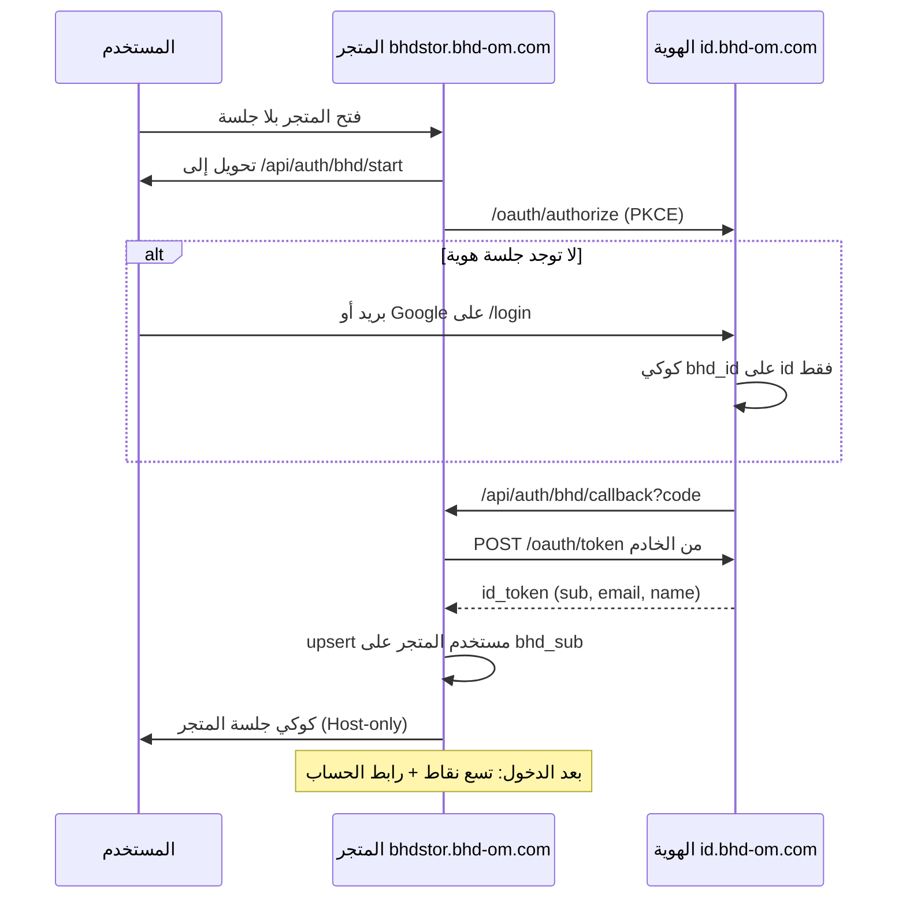

# خطة ربط متجر BHD بهوية BHD ومشغّل التطبيقات

> **لمن:** مستودع [ainoamn/BHD-STOR](https://github.com/ainoamn/BHD-STOR)  
> **المصدر المعتمد:** هذا الملف في [ainoamn/ONE-BHD](https://github.com/ainoamn/ONE-BHD) — انسخه إلى `docs/BHD-STORE-INTEGRATION.md` داخل المتجر  
> **التاريخ:** 19 أغسطس 2026  
> **المواصفات:** `bhd-identity.v1` + `bhd-appswitcher.v1`  
> **النطاق:** توحيد **تسجيل الدخول** و**شاشة التطبيقات** فقط

المتجر يبقى مستقلاً: الطلبات، المحافظ، المدفوعات، الفواتير، أدوار البائع/المشرف، والصلاحيات **لا تُنقل ولا تُشارك**. لا تُنسخ جداول الهوية. لا تُستخدم قاعدة بيانات البوابة.

انسخ أيضاً بدون تعديل:

- [BHD-IDENTITY-SSO.md](./BHD-IDENTITY-SSO.md) — نفّذ **القسم 6** حرفياً
- [BHD-APP-SWITCHER.md](./BHD-APP-SWITCHER.md) — نفّذ بعد نجاح الدخول

تنفيذ المنتج التفصيلي: [`BHD-STORE-IDENTITY.md`](./BHD-STORE-IDENTITY.md)

---

## 0. عقد التنفيذ (لا تتجاوزه)

1. **لا تشارك** `DATABASE_URL` مع البوابة أو وازن أو أي منتج.
2. **لا تضبط** `Domain=.bhd-om.com` على أي كوكي.
3. **لا تضمّن** الهوية في `iframe`. النقر ينتقل انتقالاً كاملاً.
4. **لا تضع** زر Google على واجهة المتجر بعد الربط. جوجل على `id.bhd-om.com` فقط.
5. **لا تبنِ** تسجيل مستخدم نهائي جديد في المتجر. التسجيل في الهوية. البريد المحلي يبقى على `?local=1` للطوارئ.
6. **لا تنسخ** كلمات المرور ولا هاشاتها من المتجر إلى الهوية أو العكس.
7. المعرّف المشترك الوحيد: JWT `sub` = `bhd_users.id` في الهوية = عمود `bhd_sub` في المتجر.
8. لا تبدأ مشغّل التطبيقات قبل أن يعمل `GET /api/auth/bhd/start` بتحويل 302 إلى الهوية.

---

## 1. ماذا يُربط وكيف



بعد هذا الربط: من البوابة، اختيار المتجر يفتح `https://bhdstor.bhd-om.com/api/auth/bhd/start?returnTo=/`. إن كانت جلسة الهوية قائمة لا تُطلب كلمة مرور مرة ثانية.

**المتجر لا يحوّل إلى نفسه في خطوة الترخيص.** البوابة تفعل ذلك لأنها هي الهوية. هذا الخطأ الأشيع.

---

## 2. قيم مجمّدة للمتجر — لا تغيّرها

| المفتاح | القيمة |
|---|---|
| `client_id` | `bhd-store` |
| Issuer | `https://id.bhd-om.com` |
| اكتشاف OIDC | `https://id.bhd-om.com/.well-known/openid-configuration` |
| الدخول | `https://id.bhd-om.com/login` |
| الحساب | `https://id.bhd-om.com/account` |
| الإنتاج | `https://bhdstor.bhd-om.com` |
| `redirect_uri` الإنتاج | `https://bhdstor.bhd-om.com/api/auth/bhd/callback` |
| `redirect_uri` محلي | `http://localhost:3000/api/auth/bhd/callback` |
| `post_logout_redirect_uri` | `https://bhdstor.bhd-om.com/` |
| scopes | `openid profile email` |
| PKCE | `S256` إلزامي |
| DNS | `bhdstor` CNAME → `cname.vercel-dns.com` |

`redirect_uri` يُقارَن مطابقة تامة. **ليس** `store.bhd-om.com`.

---

## 3. المرحلة أ — الدخول الموحّد (القسم 6)

موجود في المتجر: migration `017` (`users.bhd_sub`)، `GET /api/auth/bhd/start`، `callback`، `logout`، و`/auth/login` غلاف يحوّل إلى الهوية إلا `?local=1`.

**تحذير:** `start` يحوّل إلى `https://id.bhd-om.com/oauth/authorize?client_id=bhd-store` لا إلى أصل المتجر.

---

## 4. المرحلة ب — شاشة التطبيقات (بعد نجاح أ)

انسخ من `BHD-Complete-Brand-and-Portal-v1.1.0/` في ONE-BHD **كما هي**:

| من ONE-BHD | إلى المتجر |
|---|---|
| `app/lib/bhd/apps.ts` | `frontend/src/lib/bhd/apps.ts` |
| `app/components/bhd/BhdAppSwitcher.tsx` | بجانب أيقونة المستخدم بعد الجلسة |
| `app/components/bhd/BhdAppIcon.tsx` | مع المشغّل |
| أنماط `.bhd-switcher-*` و`.bhd-app-icon` | CSS المتجر |

قواعد المشغّل:

- يظهر **فقط** بعد جلسة متجر صالحة.
- يسار الصورة في RTL.
- رابط «الحساب» = `https://id.bhd-om.com/account` (ليس صفحة المتجر).
- الخروج يستدعي خروج المتجر ثم `end-session`.
- لا تُضف تطبيقاً محلياً إلى `apps.ts`. القائمة تُحدَّث في ONE-BHD ثم تُنسخ.
- لا تُظهر `/admin` داخل المشغّل. لوحة المتجر تبقى روابط المتجر الحالية.

---

## 5. ما يفعله ONE-BHD بعد نجاح المتجر

عندما يرد `GET https://bhdstor.bhd-om.com/api/auth/bhd/start` بتحويل إلى `id.bhd-om.com`:

1. في `lib/bhd/apps.ts` يُقلَب عنصر المتجر من `mode: "browse"` إلى `mode: "sso"`.
2. يُعاد نسخ الملف إلى البوابة وباقي المواقع.

---

## 6. اختبار إلزامي قبل القطع

1. مستخدم جديد يسجّل على `id.bhd-om.com` → يدخل المتجر دون نموذج ثانٍ.
2. نفس المستخدم من البوابة بعد قلب `mode` يفتح المتجر داخلًا دون كلمة مرور إن جلسة الهوية قائمة.
3. مستخدم متجر قديم ببريد موثّق مطابق → لا يُنشأ صف ثانٍ.
4. `state` أو `nonce` خاطئ → رفض.
5. فتح المتجر بعد الخروج يطلب دخولاً عبر الهوية.
6. بلا جلسة متجر: لا أيقونة تسع نقاط.
7. بعد الدخول: التسع نقاط بجانب الصورة، «الحساب» يفتح `https://id.bhd-om.com/account`.
8. طلبات المتجر ومحافظه لم تُمس. لا طلبات إلى `DATABASE_URL` الهوية من المتجر.

---

## 7. تعريف «تم»

- [x] `bhd_sub` على مستخدم المتجر
- [x] `/api/auth/bhd/start` يحوّل إلى `id.bhd-om.com`
- [x] `/api/auth/bhd/callback` يصدر جلسة المتجر
- [x] الخروج يمسح المتجر ثم `end-session`
- [x] أُزيل زر Google من واجهة المتجر
- [x] المشغّل يظهر بعد الدخول فقط
- [x] أُبلغ ONE-BHD لقلب `mode` إلى `"sso"`

---

## 8. رسالة لصق لوكيل المتجر

```text
نفّذ docs/BHD-STORE-INTEGRATION.md كما هي.
المصدر: https://github.com/ainoamn/ONE-BHD/blob/main/docs/BHD-STORE-INTEGRATION.md
المواصفات: BHD-IDENTITY-SSO.md القسم 6، وBHD-APP-SWITCHER.md بعد نجاح الدخول.
النطاق: دخول موحّد + مشغّل تطبيقات فقط.
لا تشارك DATABASE_URL. لا Domain=.bhd-om.com. لا iframe. لا زر Google على المتجر.
client_id=bhd-store
Issuer=https://id.bhd-om.com
redirect_uri=https://bhdstor.bhd-om.com/api/auth/bhd/callback
حوّل authorize وtoken إلى الهوية لا إلى أصل المتجر.
بعد النجاح أبلغ ONE-BHD لقلب mode المتجر إلى sso.
```
